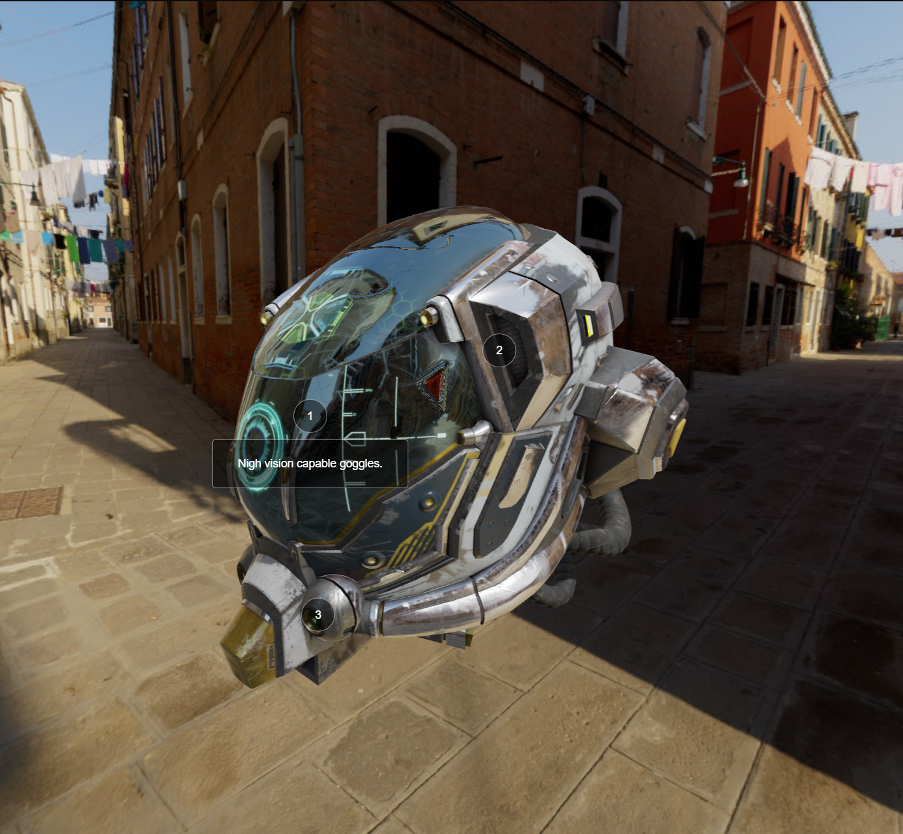

# Three.js Journey - Course by Bruno Simon
## 35 - Mixing HTML and WebGL
This exercise is about mixing HTML and WebGL.  
If the user hovers their mouse over one of the numbers, a textfield tooltip will appear with a description of the helmet's details.



### Setup instructions
Download [Node.js](https://nodejs.org/en/download/).
Run this followed commands:

``` bash
# Install dependencies (only the first time)
npm install

# Run the local server at localhost:8080
npm run dev

# Build for production in the dist/ directory
npm run build
```